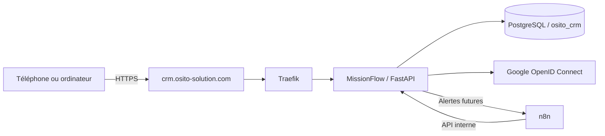
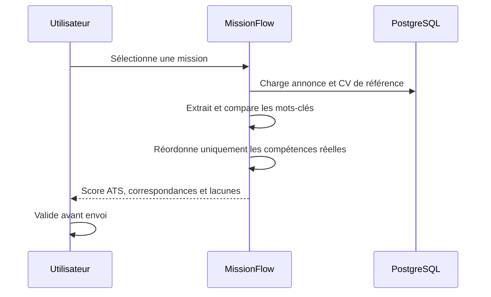
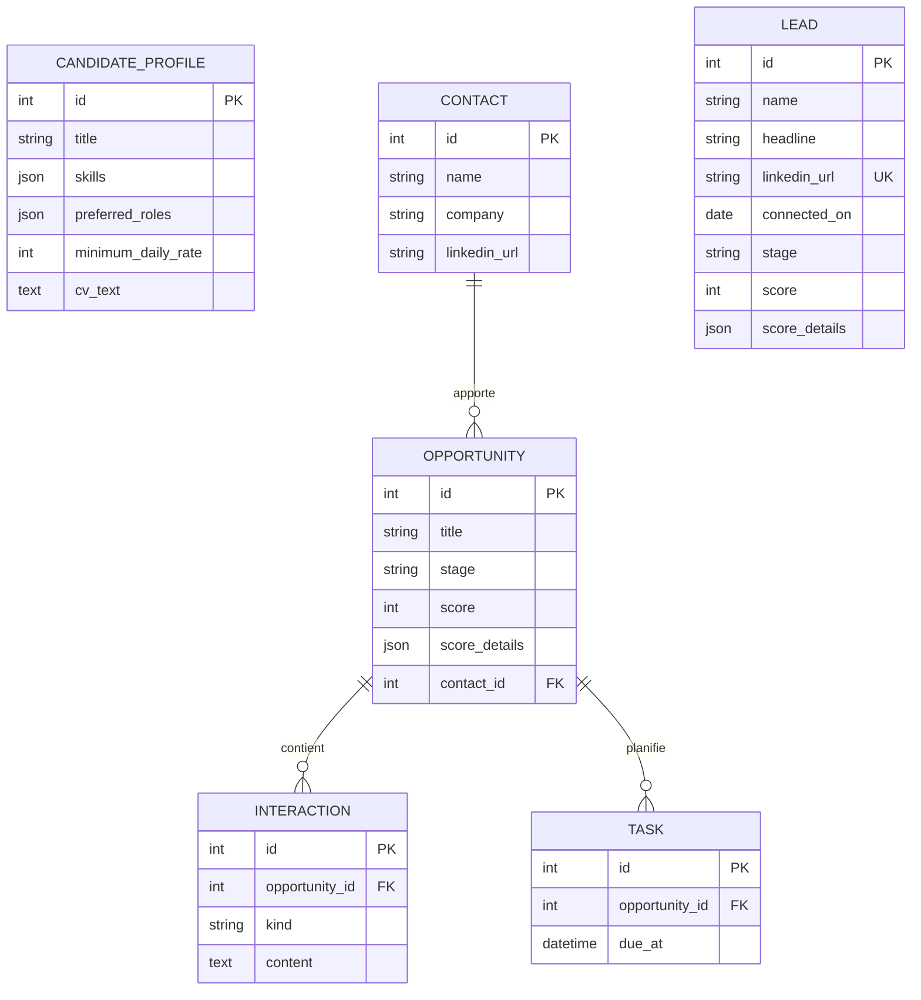

# Architecture de MissionFlow

## Objectif

MissionFlow est le CRM personnel d'OSITO consacré à la recherche de missions Salesforce. Il centralise les opportunités, calcule leur compatibilité avec le profil de Boubacar, suit leur progression et prépare une adaptation ATS fidèle au CV.

## Vue d'ensemble



Tous les conteneurs communiquent sur le réseau Docker privé `osito-net`. Seuls les ports 80 et 443 de Traefik sont exposés publiquement. PostgreSQL et l'API interne ne sont pas directement exposés.

## Composants

| Composant | Responsabilité |
|---|---|
| Traefik | Terminaison TLS, certificat Let's Encrypt, routage et en-têtes de sécurité |
| MissionFlow | Interface responsive, API, pipeline de pistes et missions, scoring et analyse ATS |
| PostgreSQL | Persistance des profils, contacts, missions, interactions et tâches |
| Google OIDC | Authentification, adresse autorisée et identité vérifiée |
| n8n | Imports, rappels, notifications et orchestration future |

## Authentification Google

L'application utilise le flux OpenID Connect côté serveur avec les seuls scopes `openid email profile`. Elle ne conserve pas les jetons Google dans la base. Après validation de la réponse Google, elle vérifie que l'adresse est confirmée et correspond exactement à `GOOGLE_ALLOWED_EMAIL`, puis crée une session chiffrée et signée valable douze heures.

URI de redirection de production :

```text
https://crm.osito-solution.com/auth/google/callback
```

Le `GOOGLE_CLIENT_SECRET` reste exclusivement dans `/opt/osito-crm/.env` sur le VPS. Il ne doit jamais être ajouté à GitHub.

## Scoring des missions

Le score sur 100 reste explicable :

| Dimension | Maximum |
|---|---:|
| Compétences du profil présentes dans l'annonce | 45 |
| Correspondance avec le rôle recherché | 20 |
| Écosystème Salesforce | 15 |
| Localisation et mode de travail | 10 |
| Compatibilité avec le TJM minimum | 10 |

Le détail est stocké en JSON avec la mission. Une modification du profil recalcule toutes les opportunités.

## Scoring des pistes

Les nouvelles connexions LinkedIn sont enregistrées avec leur date de connexion, intitulé, entreprise, URL et source. Le score mesure leur capacité probable à ouvrir l'accès à une mission : fonction commerciale (30 points), écosystème IT/CRM (30), accès aux missions ou au staffing (25) et récence de la connexion (10). Le score sert à prioriser les actions ; il ne constitue pas une certitude sur la personne.

Pipeline initial : `nouvelle`, puis `à contacter`, `message envoyé`, `échange en cours`, `mission détectée`, `à réactiver` ou `hors cible`.

## Adaptation ATS



Le moteur ne transforme jamais un mot-clé manquant en compétence acquise. Les lacunes sont présentées comme éléments à vérifier. Toute version finale doit être validée humainement.

## Modèle de données



## Déploiement

Le dépôt est installé sous `/opt/osito-crm/repo`. Les secrets vivent dans `/opt/osito-crm/.env` avec des droits restreints. `docker-compose.prod.yml` construit `osito-crm`, rejoint le réseau existant et déclare ses règles Traefik.

Le déploiement doit suivre cet ordre : sauvegarde, récupération Git en avance rapide, construction, démarrage, contrôle de santé, puis test HTTPS et OAuth. Une restauration ne doit jamais être lancée automatiquement.

## Sauvegarde et exploitation

- Sauvegarde quotidienne de `osito_crm` avec `pg_dump --format=custom`.
- Conservation hors du conteneur et contrôle de l'archive avec `pg_restore --list`.
- Journaux applicatifs accessibles avec `docker logs osito-crm`.
- État applicatif avec `docker inspect osito-crm` et `/api/health`.
- Rotation périodique du secret de session et du secret OAuth.
